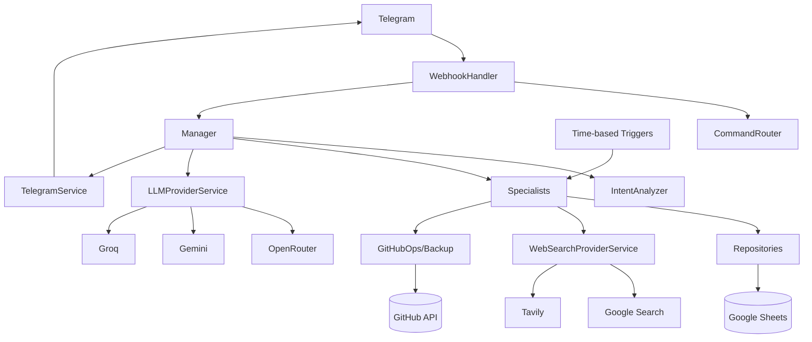

# 02 — Architecture, Data Model, Execution Flows & Dependencies

## 1. Runtime architecture

## 2. Model lapisan

| Lapisan | Peran | Isi utama |
| --- | --- | --- |
| 00 Config | Configuration/cache | Script Properties, model names, tokens, IDs. |
| 01 Gateway | Infrastructure | Akses Google Spreadsheet dan penambahan baris aman. |
| 02 Utilities | Cross-cutting | ID serta pemformatan tanggal/waktu. |
| 03 Logger | Cross-cutting | Log sistem secara best-effort. |
| 04 Repositories | Persistence | Sheets-backed repositories. |
| 05 Services | External adapters | Telegram. |
| 06 Services | External adapters | Abstraksi provider LLM dan provider konkret. |
| 07 Services | External adapters | Abstraksi pencarian web dan provider konkret. |
| 08 Specialists | Domain/AI capabilities | Chat, keuangan, reminder, memori, code, proyek, dan manajemen diri. |
| 09 Manager/Router | Application orchestration | Webhook-adjacent command + conversation routing. |
| 10 Handler | Ingress | Telegram webhook. |
| 11 Triggers | Automation | Pekerjaan terjadwal dan wrapper. |
| 12/13 service DevOps | Kontrol source | Backup GitHub dan aksi operasional GitHub API. |
| 99 Tests | Verification helpers | Pengujian manual/debug yang tersedia di source. |

## 3. Main request path

1. Telegram posts update to `doPost(e)`.
2. `WebhookHandler.handle(e)` memvalidasi aturan header/token shared-secret yang diterapkan di `_isAuthorized()` dan memeriksa ID update duplikat.
3. `_processMessage()` extracts `chatId` and text.
4. `Manager.processConversationalMessage()` becomes the application entry for natural language.
5. `_gatherContext()` collects recent history and relevant persistent context.
6. `IntentAnalyzer.analyze()` builds a structured classification prompt and asks the LLM chain for JSON.
7. `_parseResponse()` parses the returned structure; failures route to `_handleIntentFailure()`.
8. `Manager._persistAutoFacts()` menyimpan pembaruan memori/profil yang dikembalikan sebelum/sekitar proses routing.
9. `Manager._routeIntent()` dispatches by `intent.tipe` and other intent fields.
10. Specialist executes domain logic or builds a final LLM answer.
11. `TelegramService.sendMessage()` returns the response to Telegram.

## 4. Explicit command path

`CommandRouter.isKnownCommand()` mengenali perintah bergaya slash sebelum interpretasi percakapan normal. Router menangani pola `/diagnose`, `/heal`, `/logs`, `/patch`, `/build`, dan `/ingat`, sedangkan `/patch apply` merupakan jalur aksi terpisah.

## 5. Intent routing model

Tipe intent utama yang teramati pada `Manager._routeIntent()`:

| Routing value/path | Observed behavior |
| --- | --- |
| ack_reminder | Acknowledge/manage a pending reminder. |
| buat_reminder | Membuat reminder. |
| diagnose_error | Self-healing diagnosis. |
| update_docs | Documentation update. |
| audit_code | Code audit. |
| fix_audit | Menghasilkan/menerapkan perbaikan audit. |
| check_changes | Change detector. |
| roadmap_query | Membangun/memeriksa/mengadaptasi roadmap. |
| implement_feature | Blueprint/code generation. |
| self_query | Self-awareness/system state. |
| chat_biasa | Normal conversation. |
| heavy chat path | Advanced model path based on complexity. |
| web-grounded chat path | Search + LLM response. |

## 6. Context assembly

Prompt intent dapat menggunakan:
- Persona (`BOT_PERSONA` / `_personaSection()`)
- Recent chat (`ChatHistoryRepository`)
- Active facts (`FactsRepository` / `KnowledgeSpecialist`)
- User profile (`UserProfileSpecialist`)
- Long-term memory summaries (`MemorySpecialist`)
- Active/pending reminders (`ReminderRepository` / `ReminderSpecialist`)
- Acknowledgement patterns (`AckPatternsRepository`)
- Additional classification/output rules.

Hal ini membuat deteksi intent bersifat stateful dan sadar konteks, tetapi juga menjadikan ukuran prompt dan kualitas konteks sebagai faktor utama keandalan.

## 7. Data model / Sheet-backed persistence

| Penyimpanan | Isi utama | Identitas | Digunakan oleh |
| --- | --- | --- | --- |
| Chat_History | Chat messages | MSG-* | Input percakapan terbaru dan ringkasan malam. |
| Memory_Facts | Facts | MEM-* | Fakta jangka panjang, status aktif. |
| User_Profile | Profile attributes | key/value upsert | Personalization/context. |
| Memory_Summaries | Daily summaries | summary-based | Long-term memory. |
| Reminder_RawData | Reminder lifecycle | REM-* | Penjadwalan, status, pengulangan, metadata notifikasi. |
| Reminder_AckPatterns | Perilaku acknowledgement | pattern records | Konteks interpretasi acknowledgement yang dipelajari. |
| Finance_Wallets | Wallet/account master | WAL-* | Saldo awal dan identitas. |
| Finance_Transactions | Transactions | TRX-* | Buku transaksi pemasukan/pengeluaran dengan soft delete. |
| Finance_Budgets | Budgets | BUD-* | Category/period limits. |
| Log_System | System events | timestamp | Operational trace. |
| Audit_Reports | Audit runs | report-based | Audit summaries. |
| Audit_Findings | Audit issues | finding-based | Finding state + remediation. |
| Code_Snapshots | Hash snapshot source | berbasis snapshot | Deteksi perubahan. |
| Roadmap_Items | Roadmap | berbasis item | Status roadmap proyek. |
| Dokumentasi | Dokumen | fileName/content | Sumber dokumentasi untuk alur backup/pembaruan GitHub tertentu. |
| Self_Reviews | Self-awareness reports | review-based | Penyimpanan self-review sistem. |
| SelfHeal_Patches | Kandidat perbaikan | patch-based | Status patch dan code yang dihasilkan. |
| GitHub | VCS eksternal | Object API | Status backup/kontrol source; bukan persistence lokal. |

## 8. Finance model

Wallet merupakan dimensi akun. Transaksi merujuk pada ID wallet dan berisi tanggal transaksi, tipe, kategori, jumlah, deskripsi, dan status. Saldo dihitung dari transaksi, bukan disimpan sebagai saldo yang terus dimutasi pada repository transaksi. Budget menggunakan kunci kategori + periode, dan penulisan transaksi memanggil pemeriksaan peringatan budget.

## 9. Reminder model

Sebuah reminder berisi deskripsi, waktu awal, status, prioritas, catatan, tipe/konfigurasi pengulangan, metadata notifikasi terakhir, dan jumlah notifikasi. `ReminderSpecialist` menentukan reminder yang jatuh tempo dan menangani acknowledgement/completion/snooze. Trigger berbasis menit mengirim notifikasi ke `Config.myChatId`.

## 10. LLM architecture

### Advanced chain
`OpenRouter advanced → Gemini Pro Preview → Gemini Flash → Groq`.

### Fast chain
`OpenRouter fast → Gemini Flash → Groq`.

ID model aktual dapat dikonfigurasi untuk OpenRouter dan Gemini melalui Script Properties; Groq memiliki konstanta model yang ditentukan oleh source.

## 11. Pencarian web architecture

`WebSearchProviderService.getProviders()` secara lazy mengembalikan `[GoogleSearchProvider, TavilySearchProvider]`. Pencarian dijalankan berurutan sampai salah satu provider berhasil. Pembuatan lazy ini disengaja karena referensi langsung tingkat atas ke object provider lain dapat sensitif terhadap urutan pemuatan file Apps Script.

## 12. GitHub architecture

Two related components exist:

- `GitHubBackupService`: backups Apps Script project source and documentation to the configured repository/branch.
- `GitHubOpsService`: source/document reading, directory listing, source aggregation, branch creation, backup branch creation, file commits, PR creation and documentation updates.

Hal ini membentuk jembatan antara agent Apps Script yang sedang berjalan dan repository source miliknya sendiri.

## 13. Scheduled automation

| Schedule | Handler | Tujuan |
| --- | --- | --- |
| Every minute | `cekDanKirimReminder` | Due reminder notification. |
| Daily ~23:30 | `runNightlySummarizerWrapper` | Daily memory summarization. |
| Monday ~07:00 | `runScheduledAuditWrapper` | Audit terjadwal; komentar source menyatakan audit ringan pada Senin dan audit penuh pada hari pertama bulan, tetapi handler trigger aktual berjalan setiap Senin. |
| Sunday ~20:00 | `runWeeklyChangeCheckWrapper` | Snapshot source/deteksi perubahan. |
| Backup harian (function setup tersedia) | `runFullBackup` | Backup source/dokumentasi ke GitHub; memerlukan pemanggilan setup trigger. |

## 14. Dependency matrix

| Caller/group | Primary dependencies | Concern |
| --- | --- | --- |
| WebhookHandler | CommandRouter, Manager, Config | Ingress |
| Manager | IntentAnalyzer, specialists, ChatHistoryRepository, TelegramService | Core orchestration |
| IntentAnalyzer | LLMProviderService, context data | Structured intent |
| FinanceSpecialist | Wallet/Transaction/Budget repositories | Finance domain |
| ReminderSpecialist | ReminderRepository, Knowledge | Reminder lifecycle |
| SelfHealingSpecialist | AppLogger, GitHubOpsService, PatchValidator, LLMProviderService | Repair |
| FeatureArchitect | Project context, LLMProviderService, Documentation/ProjectBrain and GitHub-related capabilities | Pembuatan implementasi |
| CodeAuditor | LLMProviderService, GitHub/source data, sheet persistence | Audit |
| ProjectBrain | Dokumentasi/GitHub/source + Roadmap sheet | Manajemen proyek |
| GitHub services | UrlFetchApp + Script Properties | VCS automation |
| Triggers | Specialists + TelegramService | Scheduled automation |

## 15. Batas arsitektur yang harus dipertahankan

- Akses Telegram API harus tetap melalui `TelegramService`.
- Panggilan LLM eksternal sebaiknya tetap melalui object provider dan `LLMProviderService` jika memungkinkan.
- Pencarian harus tetap melalui `WebSearchProviderService`.
- Akses data Sheet harus tetap berada di repository/gateway, bukan tersebar di specialist.
- Eksekusi patch yang dihasilkan harus tetap melalui validasi dan status siklus hidup patch yang eksplisit.
- Handler trigger harus menyediakan function wrapper global karena trigger berbasis waktu Apps Script memanggil nama function global.

## 16. Architecture-level observed issues

- **Celah keterjangkauan FinanceSpecialist:** specialist tersedia, tetapi jalur utama `Manager._routeIntent()` yang teramati tidak menunjukkan cabang intent keuangan khusus dengan pola yang jelas seperti reminder/roadmap/audit/self-healing. Karena itu, fungsi keuangan didokumentasikan sebagai code yang terimplementasi, tetapi tidak diasumsikan sepenuhnya dapat dijangkau dari routing intent biasa.
- **Celah kontrak ProjectBrain:** inspeksi source menemukan pemanggilan `ProjectBrain.updateRoadmapStatus()` pada code berorientasi fitur, sementara method yang sesuai tidak ada dalam inventaris object ProjectBrain saat ini. Hal ini harus diperlakukan sebagai defect kompatibilitas konkret sampai direkonsiliasi.
- **Celah loop self-healing:** diagnosis → pembuatan patch → validasi/penerapan patch → deploy → verifikasi perilaku belum menjadi closed loop yang sepenuhnya otonom.
- **Celah semantik trigger:** komentar scheduler audit menjelaskan logika audit ringan pada Senin dan audit penuh pada hari pertama bulan, sedangkan konfigurasi trigger yang terlihat berjalan setiap Senin pukul 07:00; pemilihan penuh-vs-ringan bergantung pada detail implementasi `runScheduledAudit()` dan tidak boleh disimpulkan melebihi bukti code.
- **Ketergantungan dokumentasi:** sebagian fungsi manajemen diri proyek masih membaca artefak dokumentasi yang disimpan melalui aplikasi, sehingga dokumentasi sendiri dapat menjadi dependensi runtime.