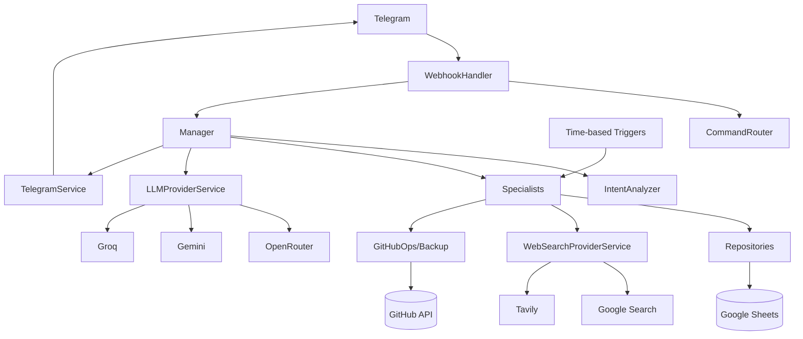

# 02 — Arsitektur, Model Data, Alur Eksekusi & Dependensi

## 1. Arsitektur runtime

## 2. Model layer

| Layer | Peran | Konten utama |
| --- | --- | --- |
| 00 Config | Konfigurasi/cache | Script Properties, model names, tokens, IDs. |
| 01 Gateway | Infrastruktur | Google Spreadsheet and safe append access. |
| 02 Utilitas | Lintas fungsi | IDs and date/time formatting. |
| 03 Logger | Lintas fungsi | Best-effort system logs. |
| 04 Repositories | Persistence | Sheets-backed repositories. |
| 05 Services | External adapters | Telegram. |
| 06 Services | External adapters | LLM provider abstraction and providers. |
| 07 Services | External adapters | Web-search abstraction and providers. |
| 08 Specialists | Area/AI capabilities | Chat, finance, reminders, memory, code, project, self-management. |
| 09 Manager/Router | Application orchestration | Webhook-adjacent command + conversation routing. |
| 10 Handler | Ingress | Telegram webhook. |
| 11 Triggers | Automation | Scheduled jobs and wrappers. |
| 12/13 DevOps services | Source control | GitHub backup and operational GitHub API actions. |
| 99 Tests | Verification helpers | Manual/debug tests present in source. |

## 3. Main request path

1. Telegram posts update to `doPost(e)`.
2. `WebhookHandler.handle(e)` validates the shared-secret header/token rule implemented in `_isAuthorized()` and checks duplicate update IDs.
3. `_processMessage()` extracts `chatId` and text.
4. `Manager.processConversationalMessage()` becomes the application entry for natural language.
5. `_gatherContext()` collects recent history and relevant konteks persisten.
6. `IntentAnalyzer.analyze()` builds a structured classification prompt and asks the LLM chain for JSON.
7. `_parseResponse()` parses the returned structure; failures route to `_handleIntentFailure()`.
8. `Manager._persistAutoFacts()` persists returned memory/profile updates before/around routing.
9. `Manager._routeIntent()` dispatches by `intent.tipe` and other intent fields.
10. Specialist executes domain logic or builds a final LLM answer.
11. `TelegramService.sendMessage()` returns the response to Telegram.

## 4. Explicit command path

`CommandRouter.isKnownCommand()` recognizes slash-style commands before normal conversational interpretation. The router contains handling for `/diagnose`, `/heal`, `/logs`, `/patch`, `/build`, and `/ingat` patterns, with `/patch apply` being a separate action path.

## 5. Routing intent model

Observed primary intent types in `Manager._routeIntent()`:

| Routing value/path | Observed behavior |
| --- | --- |
| ack_reminder | Acknowledge/manage a pending reminder. |
| buat_reminder | Create reminder. |
| diagnose_error | Self-healing diagnosis. |
| update_docs | Documentation update. |
| audit_code | Code audit. |
| fix_audit | Generate/apply audit fixes. |
| check_changes | Change detector. |
| roadmap_query | Build/check/adapt roadmap. |
| implement_feature | Blueprint/code generation. |
| self_query | Self-awareness/system state. |
| chat_biasa | Normal conversation. |
| heavy chat path | Advanced model path based on complexity. |
| web-grounded chat path | Search + LLM response. |

## 6. Context assembly

The intent prompt can draw from:
- Persona (`BOT_PERSONA` / `_personaSection()`)
- Recent chat (`ChatHistoryRepository`)
- Active facts (`FactsRepository` / `KnowledgeSpecialist`)
- User profile (`UserProfileSpecialist`)
- Long-term memory summaries (`MemorySpecialist`)
- Active/pending reminders (`ReminderRepository` / `ReminderSpecialist`)
- Acknowledgement patterns (`AckPatternsRepository`)
- Additional classification/output rules.

This makes intent detection stateful and context-aware, but also makes prompt size and context quality a first-class reliability concern.

## 7. Model data / Sheet-backed persistence

| Store | Primary contents | Identity | Used by |
| --- | --- | --- | --- |
| Chat_History | Chat messages | MSG-* | Recent conversation and nightly summary input. |
| Memory_Facts | Facts | MEM-* | Long-term facts, active status. |
| User_Profile | Profile attributes | key/value upsert | Personalization/context. |
| Memory_Summaries | Daily summaries | summary-based | Long-term memory. |
| Reminder_RawData | Reminder lifecycle | REM-* | Scheduling, status, recurrence, notification metadata. |
| Reminder_AckPatterns | Ack behavior | pattern records | Learned acknowledgement interpretation context. |
| Finance_Wallets | Wallet/account master | WAL-* | Starting balance and identity. |
| Finance_Transactions | Transactions | TRX-* | Income/expense ledger with soft delete. |
| Finance_Budgets | Budgets | BUD-* | Category/period limits. |
| Log_Sistem | Sistem events | timestamp | Operational trace. |
| Audit_Reports | Audit runs | report-based | Audit summaries. |
| Audit_Findings | Audit issues | finding-based | Finding state + remediation. |
| Code_Snapshots | Source snapshot hashes | snapshot-based | Change detection. |
| Roadmap_Items | Roadmap | item-based | Project roadmap state. |
| Documentation | Docs | fileName/content | Documentation source for certain GitHub backup/update flows. |
| Self_Reviews | Self-awareness reports | review-based | Sistem self-review persistence. |
| SelfHeal_Patches | Repair candidates | patch-based | Patch status and generated code. |
| GitHub | External VCS | API objects | Backup/source-control state; not local persistence. |

## 8. Finance model

Wallets are the account dimension. Transactions reference a wallet ID and contain transaction date, type, category, amount, description and status. Balance is derived rather than stored as a continuously mutated balance in the transaction repository. Budgets are keyed by category + period, and transaction writes invoke a budget-alert check.

## 9. Reminder model

A reminder contains description, first time, status, priority, notes, recurring type/configuration, last-notified metadata and notification count. `ReminderSpecialist` determines due-now reminders and handles acknowledgement/completion/snooze. Trigger berbasis menit mengirim notifikasi ke `Config.myChatId`.

## 10. LLM architecture

### Advanced chain
`OpenRouter advanced → Gemini Pro Preview → Gemini Flash → Groq`.

### Fast chain
`OpenRouter fast → Gemini Flash → Groq`.

ID model aktual dapat dikonfigurasi for OpenRouter and Gemini melalui Script Properties; Groq has a source-defined model constant.

## 11. Web search architecture

`WebSearchProviderService.getProviders()` lazily returns `[GoogleSearchProvider, TavilySearchProvider]`. Pencarian dijalankan berurutan sampai salah satu provider berhasil. Konstruksi lazy ini disengaja karena referensi top-level langsung ke object provider lain dapat sensitif terhadap urutan pemuatan file Apps Script.

## 12. GitHub architecture

Two related components exist:

- `GitHubBackupService`: backups Apps Script project source and documentation to the configured repository/branch.
- `GitHubOpsService`: source/document reading, directory listing, source aggregation, branch creation, backup branch creation, file commits, PR creation and documentation updates.

Ini membuat jembatan antara agent Apps Script yang sedang berjalan dan repository source miliknya sendiri.

## 13. Scheduled automation

| Schedule | Handler | Tujuan |
| --- | --- | --- |
| Every minute | `cekDanKirimReminder` | Due reminder notification. |
| Daily ~23:30 | `runNightlySummarizerWrapper` | Daily memory summarization. |
| Monday ~07:00 | `runScheduledAuditWrapper` | Scheduled audit; source comment says light Monday and full on day 1, but actual trigger handler is weekly Monday. |
| Sunday ~20:00 | `runWeeklyChangeCheckWrapper` | Source snapshot/change detection. |
| Daily backup (setup function exists) | `runFullBackup` | Source/documentation GitHub backup; requires setup trigger call. |

## 14. Matriks dependensi

| Caller/group | Primary dependencies | Concern |
| --- | --- | --- |
| WebhookHandler | CommandRouter, Manager, Config | Ingress |
| Manager | IntentAnalyzer, specialists, ChatHistoryRepository, TelegramService | Core orchestration |
| IntentAnalyzer | LLMProviderService, context data | Structured intent |
| FinanceSpecialist | Wallet/Transaction/Budget repositories | Finance domain |
| ReminderSpecialist | ReminderRepository, Knowledge | Reminder lifecycle |
| SelfHealingSpecialist | AppLogger, GitHubOpsService, PatchValidator, LLMProviderService | Repair |
| FeatureArchitect | Project context, LLMProviderService, Documentation/ProjectBrain and GitHub-related capabilities | Implementation generation |
| CodeAuditor | LLMProviderService, GitHub/source data, sheet persistence | Audit |
| ProjectBrain | Documentation/GitHub/source + Roadmap sheet | Project management |
| GitHub services | UrlFetchApp + Script Properties | VCS automation |
| Triggers | Specialists + TelegramService | Scheduled automation |

## 15. Batas arsitektur yang harus dipertahankan

- Telegram API access should remain through `TelegramService`.
- Pemanggilan LLM eksternal harus tetap berada di balik object provider and `LLMProviderService` where possible.
- Search should remain behind `WebSearchProviderService`.
- Akses data sheet harus tetap berada di repository/gateway, bukan tersebar di specialist.
- Eksekusi patch hasil generate harus tetap berada di belakang validasi dan state lifecycle patch yang eksplisit.
- Handler trigger harus mengekspos global wrapper function karena trigger berbasis waktu Apps Script memanggil nama function global.

## 16. Arsitektur-level teramati issues

- **FinanceSpecialist reachability gap:** the specialist exists, but the teramati primary `Manager._routeIntent()` paths do not expose an obvious dedicated finance intent branch in the same way as reminders/roadmap/audit/self-healing. Karena itu fungsi keuangan didokumentasikan sebagai code yang terimplementasi, tetapi tidak diasumsikan sepenuhnya dapat dijangkau melalui routing intent biasa.
- **ProjectBrain contract gap:** inspeksi source finds a call to `ProjectBrain.updateRoadmapStatus()` in feature-oriented code while no matching method is present in the current ProjectBrain object inventory. Ini harus diperlakukan sebagai defect kompatibilitas konkret sampai direkonsiliasi.
- **Self-healing closure gap:** diagnosis → patch generation → patch validation/application → deploy → behavioral verification belum menjadi closed loop otonom sepenuhnya.
- **Trigger semantics gap:** the audit scheduler comment describes Monday-light and first-of-month-full logic, while the visible trigger setup is weekly Monday at 07:00; full-vs-light selection depends on `runScheduledAudit()` implementation details and tidak boleh disimpulkan melampaui apa yang ada di code.
- **Documentation coupling:** some project self-management functionality still reads documentation artifacts stored through the application, sehingga dokumentasi itu sendiri dapat menjadi dependency runtime.