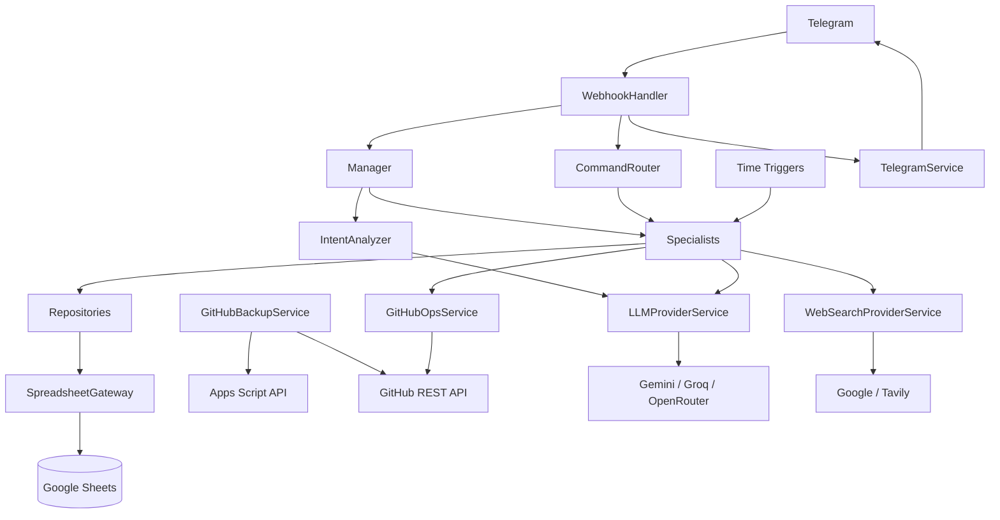

# 03 — Architecture

## 1. Architectural style

The system follows a pragmatic layered architecture tailored to Google Apps Script:

1. **Config / Utilities** — configuration, IDs, time handling.
2. **Gateway / Repository** — Google Sheets persistence and repository semantics.
3. **External Services** — Telegram, LLM, web search, GitHub.
4. **Specialists** — domain/business capabilities.
5. **Manager / Intent Analyzer / Command Router** — orchestration and interaction routing.
6. **Webhook / Triggers** — runtime entry points.

It is not a formal dependency-injection framework, event bus, or class-based OO architecture. Modules are object literals stored in `.gs` files.

## 2. Layer diagram



## 3. Component responsibilities

### Config
Single source for Script Properties. Uses in-memory caching.

### SpreadsheetGateway
Single spreadsheet/sheet access point and one shared retry helper. Note that not every repository currently uses the safe append helper; see technical debt.

### Repositories
Thin CRUD/translation layer for Sheets. They do not intentionally depend on Telegram or LLM business behavior.

### Services
External API boundaries:

- TelegramService → Telegram Bot API.
- LLMProviderService + providers → LLM APIs.
- WebSearchProviderService + providers → search APIs.
- GitHubOpsService → GitHub repository operations.
- GitHubBackupService → Apps Script API + GitHub REST for self-backup.

### Specialists
Business/agent capabilities:

- Chat
- Knowledge
- Memory
- User Profile
- Reminder
- Finance
- Project Brain
- Feature Architect
- Change Detector
- Code Auditor
- Self Healing
- Self Awareness

### Manager
Main conversational orchestration layer.

## 4. Dependency direction

The intended direction is approximately:

```text
Entry points
  -> Manager / CommandRouter
  -> Specialists
  -> Services / Repositories
  -> platform APIs
```

The code sometimes allows specialists to depend on other specialists, especially for strategic/contextual features. Examples include ProjectBrain → GitHubOps/LLM/Spreadsheet, Reminder → Knowledge, SelfAwareness → Knowledge/Profile/GitHub, and SelfHealing → GitHubOps/PatchValidator/LLM.

## 5. Lazy evaluation pattern

Several service objects deliberately return provider arrays or invoke external modules inside methods rather than top-level initialization. This is important in Google Apps Script because source-file load order and global object availability can cause `ReferenceError` if cross-file references are eagerly evaluated.

Examples:

- `LLMProviderService.CHAINS` contains provider calls inside arrow functions.
- `WebSearchProviderService.getProviders()` constructs the provider array only when called.

## 6. Runtime state

The system uses several small in-process caches, but most durable state lives in Sheets or GitHub. `Config._cache` and `SpreadsheetGateway` caches are runtime-local and should not be treated as durable state.

## 7. Source-of-truth boundaries

| Domain | Primary source |
|---|---|
| Secrets/config | Script Properties |
| Conversation history | `Chat_History` |
| User facts | `Memory_Facts` |
| User profile | `User_Profile` |
| LTM | `Memory_Summaries` |
| Reminder state | `Reminder_RawData` |
| Ack learning | `Reminder_AckPatterns` |
| Finance | `Finance_*` sheets |
| Audit state | `Audit_Reports`, `Audit_Findings` |
| Source snapshot | `Code_Snapshots` |
| Self-heal/blueprints | `SelfHeal_Patches` |
| Roadmap items | `Roadmap_Items` |
| Self review | `Self_Reviews` |
| Doc cache | `Documentation` |
| Source code | GitHub repository / deployed GAS project |

## 8. Architecture constraints encoded in prompts

Feature Architect, Code Auditor and Self Healing prompts repeat these constraints:

- object literals, not classes;
- lazy evaluation for cross-module references;
- repositories remain CRUD/data-focused;
- specialists hold business logic;
- services own external API access;
- time should be represented through `DateTimeUtils`;
- safe append helper should be used for inserts;
- transaction deletion should be soft-delete;
- identifiers should use prefix + timestamp.

The important distinction is that **some of these are design rules enforced by prompts/checks, not universally followed by every current source file**.
